# Diagramas de Secuencia - BeamFlow

Este documento contiene los diagramas de secuencia Mermaid de las funcionalidades más importantes y críticas del sistema BeamFlow.

## Índice

### Diagramas de Backend
1. [Inicio y Ejecución de Workflow](#1-inicio-y-ejecución-de-workflow)
2. [Ejecución de Step con Idempotencia](#2-ejecución-de-step-con-idempotencia)
3. [Manejo de Fallos y Compensación (Saga)](#3-manejo-de-fallos-y-compensación-saga)
4. [Dead Letter Queue (DLQ) y Retry](#4-dead-letter-queue-dlq-y-retry)
5. [Persistencia en Mnesia](#5-persistencia-en-mnesia)
6. [Visualización en Tiempo Real (LiveView)](#6-visualización-en-tiempo-real-liveview)
7. [ChaosMonkey - Inyección de Fallos](#7-chaosmonkey---inyección-de-fallos)
8. [Branching Condicional en Workflows](#8-branching-condicional-en-workflows)
9. [Validación de Idempotencia Detallada](#9-validación-de-idempotencia-detallada)

### Diagramas de Interfaces de Usuario
10. [Interfaz de Usuario - Workflow Explorer](#10-interfaz-de-usuario---workflow-explorer)
11. [Interfaz de Usuario - Workflow Graph (Detalle)](#11-interfaz-de-usuario---workflow-graph-detalle)
12. [Interfaz de Usuario - Dead Letter Queue](#12-interfaz-de-usuario---dead-letter-queue)
13. [Flujo Completo de Usuario - Demo](#13-flujo-completo-de-usuario---demo)

### Integración y API
14. [API REST - Endpoints para Integración Externa](#14-api-rest---endpoints-para-integración-externa)

### UX y Manejo de Errores
15. [Caminos de Error en UX - Recuperación de Usuario](#15-caminos-de-error-en-ux---recuperación-de-usuario)

---

## 1. Inicio y Ejecución de Workflow

Este diagrama muestra el flujo completo desde que se inicia un workflow hasta que completa todos sus steps.

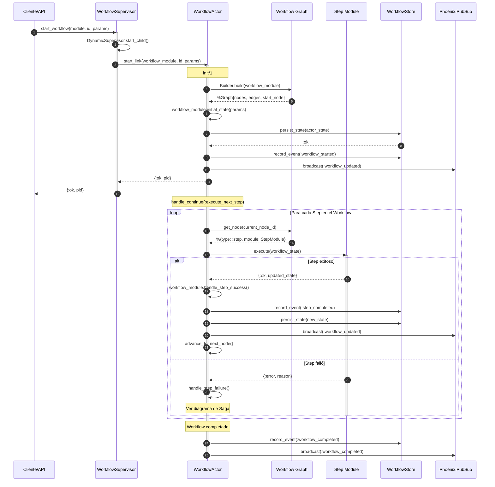
```mermaid
sequenceDiagram
    autonumber
    participant Client as Cliente/API
    participant WS as WorkflowSupervisor
    participant WA as WorkflowActor
    participant Graph as Workflow Graph
    participant Step as Step Module
    participant Store as WorkflowStore
    participant PubSub as Phoenix.PubSub

    Client->>WS: start_workflow(module, id, params)
    activate WS
    WS->>WS: DynamicSupervisor.start_child()
    WS->>WA: start_link(workflow_module, id, params)
    activate WA
    
    Note over WA: init/1
    WA->>Graph: Builder.build(workflow_module)
    Graph-->>WA: %Graph{nodes, edges, start_node}
    WA->>WA: workflow_module.initial_state(params)
    WA->>Store: persist_state(actor_state)
    Store-->>WA: :ok
    WA->>Store: record_event(:workflow_started)
    WA->>PubSub: broadcast(:workflow_updated)
    
    WA-->>WS: {:ok, pid}
    WS-->>Client: {:ok, pid}
    deactivate WS

    Note over WA: handle_continue(:execute_next_step)
    
    loop Para cada Step en el Workflow
        WA->>Graph: get_node(current_node_id)
        Graph-->>WA: %{type: :step, module: StepModule}
        
        WA->>Step: execute(workflow_state)
        activate Step
        
        alt Step exitoso
            Step-->>WA: {:ok, updated_state}
            WA->>WA: workflow_module.handle_step_success()
            WA->>Store: record_event(:step_completed)
            WA->>Store: persist_state(new_state)
            WA->>PubSub: broadcast(:workflow_updated)
            WA->>WA: advance_to_next_node()
        else Step falló
            Step-->>WA: {:error, reason}
            WA->>WA: handle_step_failure()
            Note over WA: Ver diagrama de Saga
        end
        deactivate Step
    end

    Note over WA: Workflow completado
    WA->>Store: record_event(:workflow_completed)
    WA->>PubSub: broadcast(:workflow_completed)
    deactivate WA
```

---

## 2. Ejecución de Step con Idempotencia

Este diagrama muestra cómo se garantiza la idempotencia usando claves únicas para evitar ejecuciones duplicadas.

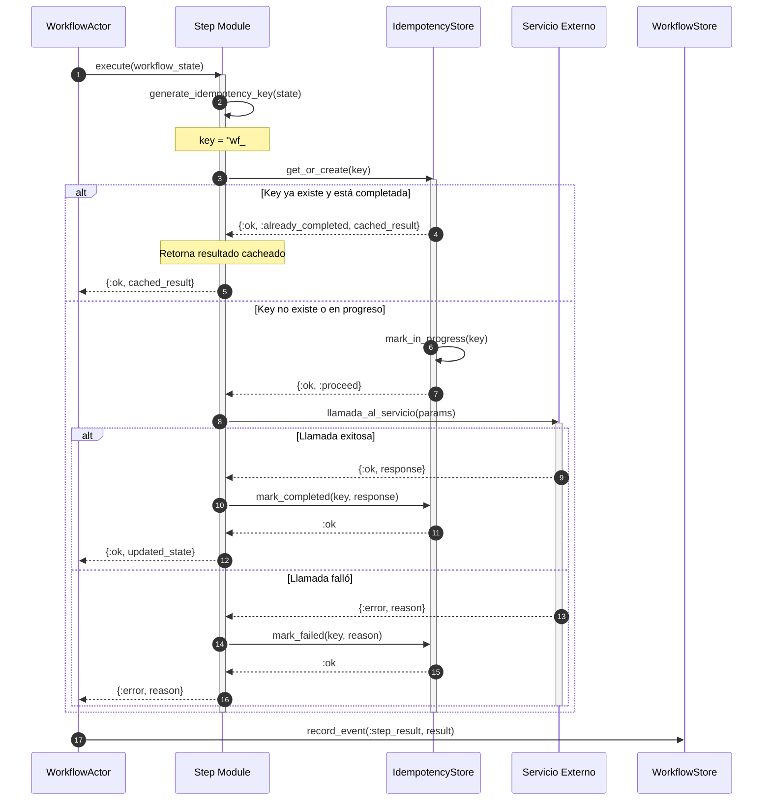
```mermaid
sequenceDiagram
    autonumber
    participant WA as WorkflowActor
    participant Step as Step Module
    participant Idem as IdempotencyStore
    participant Ext as Servicio Externo
    participant Store as WorkflowStore

    WA->>Step: execute(workflow_state)
    activate Step
    
    Step->>Step: generate_idempotency_key(state)
    Note over Step: key = "wf_#{id}_step_#{name}_#{hash}"
    
    Step->>Idem: get_or_create(key)
    activate Idem
    
    alt Key ya existe y está completada
        Idem-->>Step: {:ok, :already_completed, cached_result}
        Note over Step: Retorna resultado cacheado
        Step-->>WA: {:ok, cached_result}
    else Key no existe o en progreso
        Idem->>Idem: mark_in_progress(key)
        Idem-->>Step: {:ok, :proceed}
        
        Step->>Ext: llamada_al_servicio(params)
        activate Ext
        
        alt Llamada exitosa
            Ext-->>Step: {:ok, response}
            Step->>Idem: mark_completed(key, response)
            Idem-->>Step: :ok
            Step-->>WA: {:ok, updated_state}
        else Llamada falló
            Ext-->>Step: {:error, reason}
            Step->>Idem: mark_failed(key, reason)
            Idem-->>Step: :ok
            Step-->>WA: {:error, reason}
        end
        deactivate Ext
    end
    deactivate Idem
    deactivate Step

    WA->>Store: record_event(:step_result, result)
```

---

## 3. Manejo de Fallos y Compensación (Saga)

Este diagrama muestra el patrón Saga cuando un step falla y se ejecutan las compensaciones de los steps anteriores.

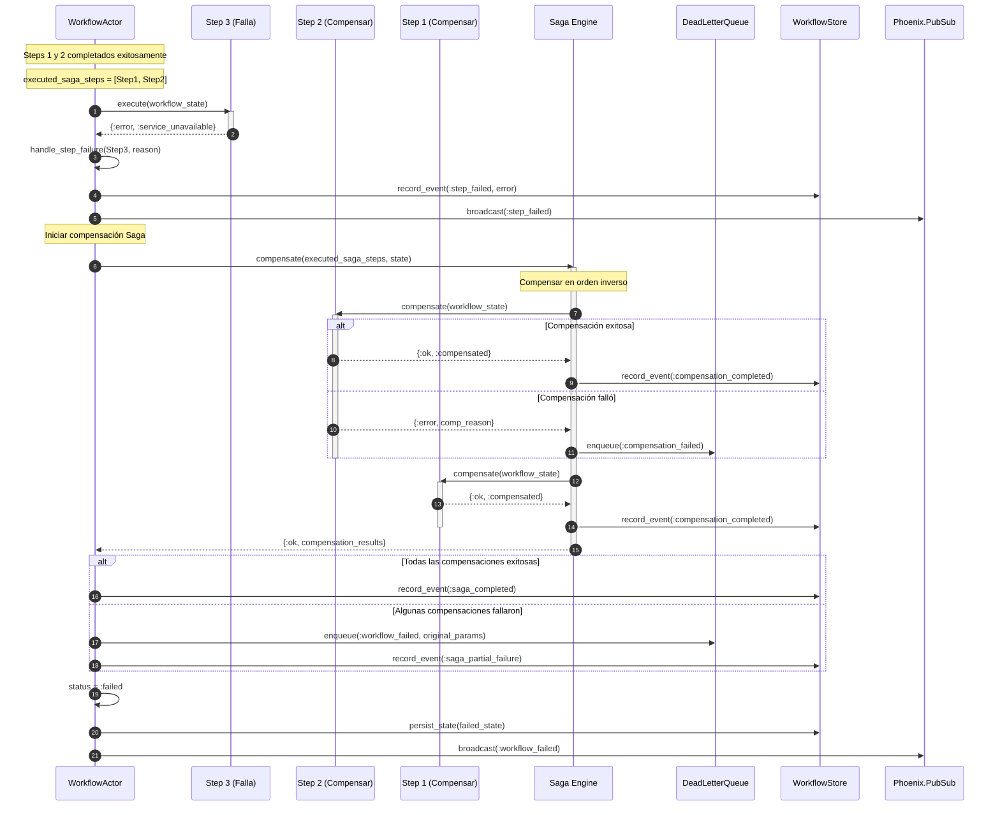
```mermaid
sequenceDiagram
    autonumber
    participant WA as WorkflowActor
    participant Step3 as Step 3 (Falla)
    participant Step2 as Step 2 (Compensar)
    participant Step1 as Step 1 (Compensar)
    participant Saga as Saga Engine
    participant DLQ as DeadLetterQueue
    participant Store as WorkflowStore
    participant PubSub as Phoenix.PubSub

    Note over WA: Steps 1 y 2 completados exitosamente
    Note over WA: executed_saga_steps = [Step1, Step2]
    
    WA->>Step3: execute(workflow_state)
    activate Step3
    Step3-->>WA: {:error, :service_unavailable}
    deactivate Step3
    
    WA->>WA: handle_step_failure(Step3, reason)
    WA->>Store: record_event(:step_failed, error)
    WA->>PubSub: broadcast(:step_failed)
    
    Note over WA: Iniciar compensación Saga
    WA->>Saga: compensate(executed_saga_steps, state)
    activate Saga
    
    Note over Saga: Compensar en orden inverso
    
    Saga->>Step2: compensate(workflow_state)
    activate Step2
    alt Compensación exitosa
        Step2-->>Saga: {:ok, :compensated}
        Saga->>Store: record_event(:compensation_completed)
    else Compensación falló
        Step2-->>Saga: {:error, comp_reason}
        Saga->>DLQ: enqueue(:compensation_failed)
    end
    deactivate Step2
    
    Saga->>Step1: compensate(workflow_state)
    activate Step1
    Step1-->>Saga: {:ok, :compensated}
    Saga->>Store: record_event(:compensation_completed)
    deactivate Step1
    
    Saga-->>WA: {:ok, compensation_results}
    deactivate Saga
    
    alt Todas las compensaciones exitosas
        WA->>Store: record_event(:saga_completed)
    else Algunas compensaciones fallaron
        WA->>DLQ: enqueue(:workflow_failed, original_params)
        WA->>Store: record_event(:saga_partial_failure)
    end
    
    WA->>WA: status = :failed
    WA->>Store: persist_state(failed_state)
    WA->>PubSub: broadcast(:workflow_failed)
```

---

## 4. Dead Letter Queue (DLQ) y Retry

Este diagrama muestra cómo los workflows fallidos se envían al DLQ y se reintentan automáticamente.

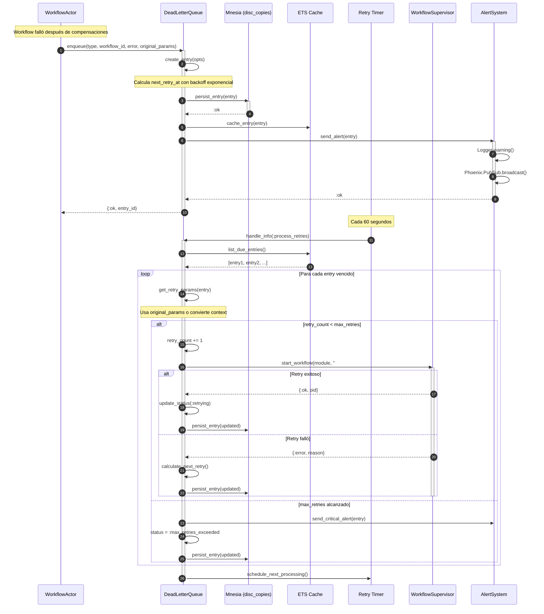
```mermaid
sequenceDiagram
    autonumber
    participant WA as WorkflowActor
    participant DLQ as DeadLetterQueue
    participant Mnesia as Mnesia (disc_copies)
    participant ETS as ETS Cache
    participant Timer as Retry Timer
    participant WS as WorkflowSupervisor
    participant Alert as AlertSystem

    Note over WA: Workflow falló después de compensaciones
    
    WA->>DLQ: enqueue(type, workflow_id, error, original_params)
    activate DLQ
    
    DLQ->>DLQ: create_entry(opts)
    Note over DLQ: Calcula next_retry_at con backoff exponencial
    
    DLQ->>Mnesia: persist_entry(entry)
    activate Mnesia
    Mnesia-->>DLQ: :ok
    deactivate Mnesia
    
    DLQ->>ETS: cache_entry(entry)
    DLQ->>Alert: send_alert(entry)
    activate Alert
    Alert->>Alert: Logger.warning()
    Alert->>Alert: Phoenix.PubSub.broadcast()
    Alert-->>DLQ: :ok
    deactivate Alert
    
    DLQ-->>WA: {:ok, entry_id}
    deactivate DLQ

    Note over Timer: Cada 60 segundos
    Timer->>DLQ: handle_info(:process_retries)
    activate DLQ
    
    DLQ->>ETS: list_due_entries()
    ETS-->>DLQ: [entry1, entry2, ...]
    
    loop Para cada entry vencido
        DLQ->>DLQ: get_retry_params(entry)
        Note over DLQ: Usa original_params o convierte context
        
        alt retry_count < max_retries
            DLQ->>DLQ: retry_count += 1
            DLQ->>WS: start_workflow(module, "#{id}_retry_N", params)
            activate WS
            
            alt Retry exitoso
                WS-->>DLQ: {:ok, pid}
                DLQ->>DLQ: update_status(:retrying)
                DLQ->>Mnesia: persist_entry(updated)
            else Retry falló
                WS-->>DLQ: {:error, reason}
                DLQ->>DLQ: calculate_next_retry()
                DLQ->>Mnesia: persist_entry(updated)
            end
            deactivate WS
        else max_retries alcanzado
            DLQ->>Alert: send_critical_alert(entry)
            DLQ->>DLQ: status = :max_retries_exceeded
            DLQ->>Mnesia: persist_entry(updated)
        end
    end
    
    DLQ->>Timer: schedule_next_processing()
    deactivate DLQ
```

---

## 5. Persistencia en Mnesia

Este diagrama muestra cómo se inicializa Mnesia con persistencia en disco y cómo se almacenan los datos.

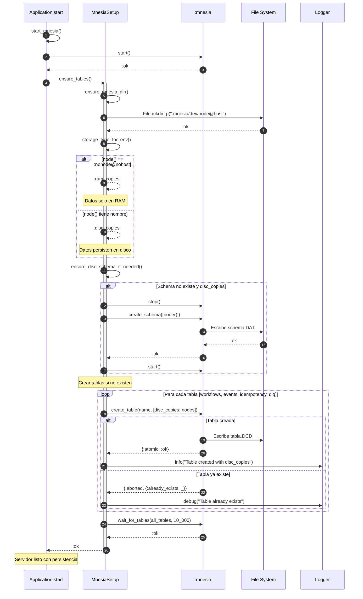
```mermaid
sequenceDiagram
    autonumber
    participant App as Application.start
    participant Setup as MnesiaSetup
    participant Mnesia as :mnesia
    participant FS as File System
    participant Logger as Logger

    App->>App: start_mnesia()
    App->>Mnesia: start()
    Mnesia-->>App: :ok
    
    App->>Setup: ensure_tables()
    activate Setup
    
    Setup->>Setup: ensure_mnesia_dir()
    Setup->>FS: File.mkdir_p(".mnesia/dev/node@host")
    FS-->>Setup: :ok
    
    Setup->>Setup: storage_type_for_env()
    alt node() == :nonode@nohost
        Setup-->>Setup: :ram_copies
        Note over Setup: Datos solo en RAM
    else node() tiene nombre
        Setup-->>Setup: :disc_copies
        Note over Setup: Datos persisten en disco
    end
    
    Setup->>Setup: ensure_disc_schema_if_needed()
    alt Schema no existe y disc_copies
        Setup->>Mnesia: stop()
        Setup->>Mnesia: create_schema([node()])
        Mnesia->>FS: Escribe schema.DAT
        FS-->>Mnesia: :ok
        Mnesia-->>Setup: :ok
        Setup->>Mnesia: start()
    end
    
    Note over Setup: Crear tablas si no existen
    
    loop Para cada tabla [workflows, events, idempotency, dlq]
        Setup->>Mnesia: create_table(name, [disc_copies: nodes])
        alt Tabla creada
            Mnesia->>FS: Escribe tabla.DCD
            Mnesia-->>Setup: {:atomic, :ok}
            Setup->>Logger: info("Table created with disc_copies")
        else Tabla ya existe
            Mnesia-->>Setup: {:aborted, {:already_exists, _}}
            Setup->>Logger: debug("Table already exists")
        end
    end
    
    Setup->>Mnesia: wait_for_tables(all_tables, 10_000)
    Mnesia-->>Setup: :ok
    
    Setup-->>App: :ok
    deactivate Setup
    
    Note over App: Servidor listo con persistencia
```

---

## 6. Visualización en Tiempo Real (LiveView)

Este diagrama muestra cómo la interfaz de usuario se actualiza en tiempo real usando Phoenix LiveView y PubSub.

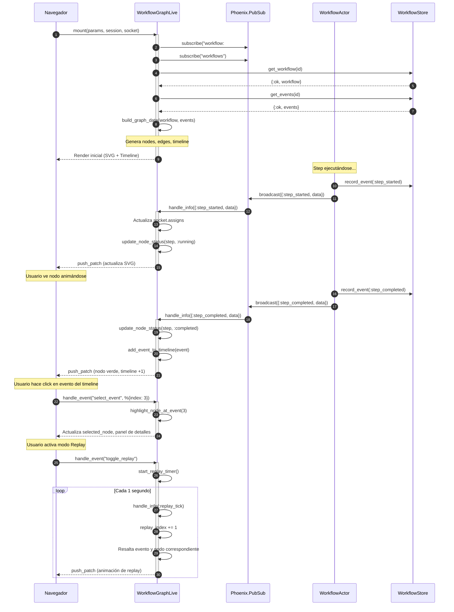
```mermaid
sequenceDiagram
    autonumber
    participant Browser as Navegador
    participant LV as WorkflowGraphLive
    participant PubSub as Phoenix.PubSub
    participant WA as WorkflowActor
    participant Store as WorkflowStore

    Browser->>LV: mount(params, session, socket)
    activate LV
    
    LV->>PubSub: subscribe("workflow:#{id}")
    LV->>PubSub: subscribe("workflows")
    LV->>Store: get_workflow(id)
    Store-->>LV: {:ok, workflow}
    LV->>Store: get_events(id)
    Store-->>LV: {:ok, events}
    
    LV->>LV: build_graph_data(workflow, events)
    Note over LV: Genera nodes, edges, timeline
    
    LV-->>Browser: Render inicial (SVG + Timeline)
    deactivate LV
    
    Note over WA: Step ejecutándose...
    WA->>Store: record_event(:step_started)
    WA->>PubSub: broadcast({:step_started, data})
    
    PubSub->>LV: handle_info({:step_started, data})
    activate LV
    LV->>LV: Actualiza socket.assigns
    LV->>LV: update_node_status(step, :running)
    LV-->>Browser: push_patch (actualiza SVG)
    deactivate LV
    
    Note over Browser: Usuario ve nodo animándose
    
    WA->>Store: record_event(:step_completed)
    WA->>PubSub: broadcast({:step_completed, data})
    
    PubSub->>LV: handle_info({:step_completed, data})
    activate LV
    LV->>LV: update_node_status(step, :completed)
    LV->>LV: add_event_to_timeline(event)
    LV-->>Browser: push_patch (nodo verde, timeline +1)
    deactivate LV
    
    Note over Browser: Usuario hace click en evento del timeline
    Browser->>LV: handle_event("select_event", %{index: 3})
    activate LV
    LV->>LV: highlight_node_at_event(3)
    LV-->>Browser: Actualiza selected_node, panel de detalles
    deactivate LV
    
    Note over Browser: Usuario activa modo Replay
    Browser->>LV: handle_event("toggle_replay")
    activate LV
    LV->>LV: start_replay_timer()
    
    loop Cada 1 segundo
        LV->>LV: handle_info(:replay_tick)
        LV->>LV: replay_index += 1
        LV->>LV: Resalta evento y nodo correspondiente
        LV-->>Browser: push_patch (animación de replay)
    end
    deactivate LV
```

---

## 7. ChaosMonkey - Inyección de Fallos

Este diagrama muestra cómo ChaosMonkey inyecta fallos controlados para probar la resiliencia del sistema.

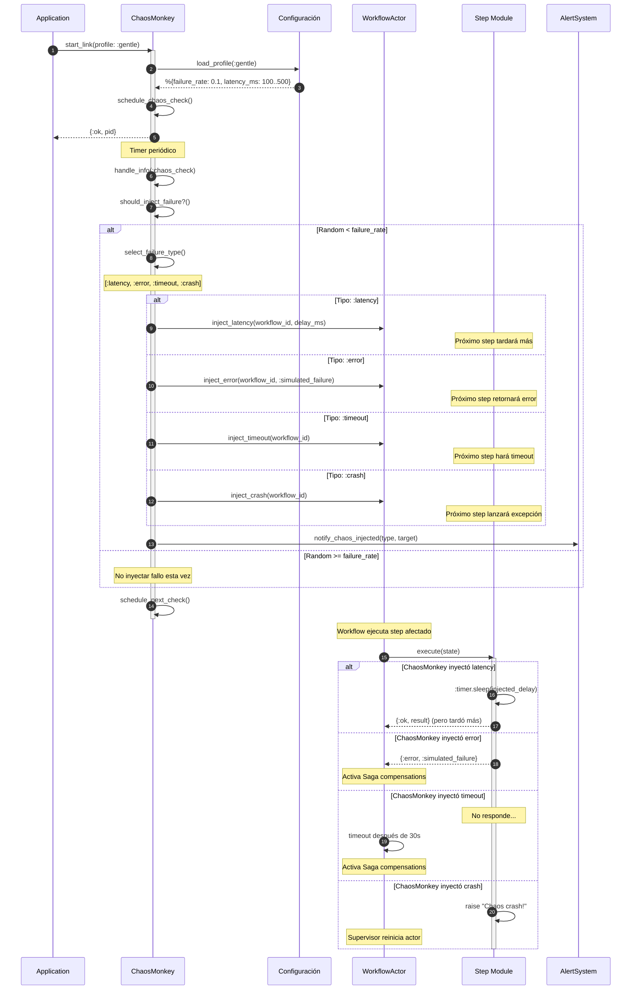
```mermaid
sequenceDiagram
    autonumber
    participant App as Application
    participant CM as ChaosMonkey
    participant Config as Configuración
    participant WA as WorkflowActor
    participant Step as Step Module
    participant Alert as AlertSystem

    App->>CM: start_link(profile: :gentle)
    activate CM
    
    CM->>Config: load_profile(:gentle)
    Config-->>CM: %{failure_rate: 0.1, latency_ms: 100..500}
    CM->>CM: schedule_chaos_check()
    CM-->>App: {:ok, pid}
    
    Note over CM: Timer periódico
    
    CM->>CM: handle_info(:chaos_check)
    CM->>CM: should_inject_failure?()
    
    alt Random < failure_rate
        CM->>CM: select_failure_type()
        Note over CM: [:latency, :error, :timeout, :crash]
        
        alt Tipo: :latency
            CM->>WA: inject_latency(workflow_id, delay_ms)
            Note over Step: Próximo step tardará más
        else Tipo: :error
            CM->>WA: inject_error(workflow_id, :simulated_failure)
            Note over Step: Próximo step retornará error
        else Tipo: :timeout
            CM->>WA: inject_timeout(workflow_id)
            Note over Step: Próximo step hará timeout
        else Tipo: :crash
            CM->>WA: inject_crash(workflow_id)
            Note over Step: Próximo step lanzará excepción
        end
        
        CM->>Alert: notify_chaos_injected(type, target)
    else Random >= failure_rate
        Note over CM: No inyectar fallo esta vez
    end
    
    CM->>CM: schedule_next_check()
    deactivate CM
    
    Note over WA: Workflow ejecuta step afectado
    
    WA->>Step: execute(state)
    activate Step
    
    alt ChaosMonkey inyectó latency
        Step->>Step: :timer.sleep(injected_delay)
        Step-->>WA: {:ok, result} (pero tardó más)
    else ChaosMonkey inyectó error
        Step-->>WA: {:error, :simulated_failure}
        Note over WA: Activa Saga compensations
    else ChaosMonkey inyectó timeout
        Note over Step: No responde...
        WA->>WA: timeout después de 30s
        Note over WA: Activa Saga compensations
    else ChaosMonkey inyectó crash
        Step->>Step: raise "Chaos crash!"
        Note over WA: Supervisor reinicia actor
    end
    deactivate Step
```

---

## Flujo General del Sistema

Este diagrama muestra la arquitectura general y cómo interactúan todos los componentes.

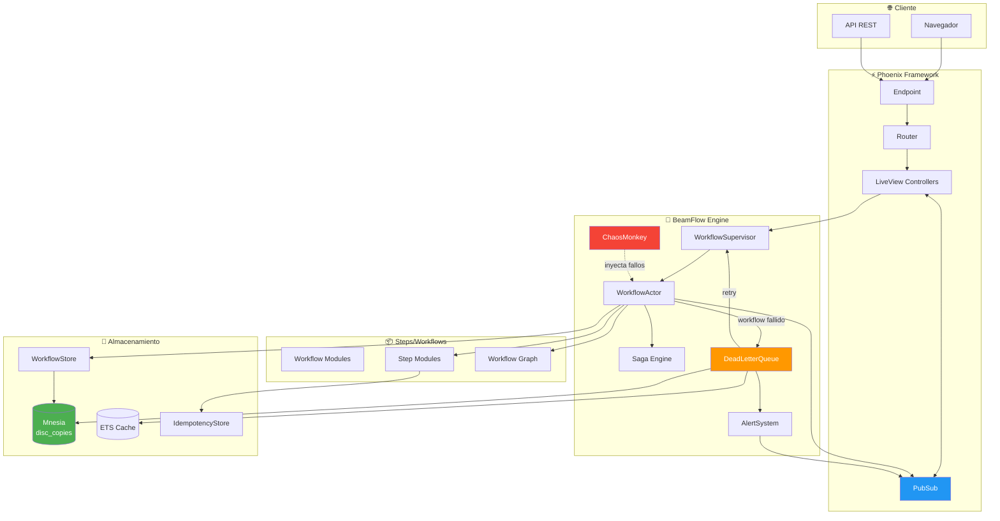
```mermaid
flowchart TB
    subgraph Cliente["🌐 Cliente"]
        Browser[Navegador]
        API[API REST]
    end

    subgraph Phoenix["⚡ Phoenix Framework"]
        Endpoint[Endpoint]
        Router[Router]
        LiveView[LiveView Controllers]
        PubSub[PubSub]
    end

    subgraph Engine["🔧 BeamFlow Engine"]
        WS[WorkflowSupervisor]
        WA[WorkflowActor]
        Saga[Saga Engine]
        DLQ[DeadLetterQueue]
        Alert[AlertSystem]
        Chaos[ChaosMonkey]
    end

    subgraph Steps["📦 Steps/Workflows"]
        WM[Workflow Modules]
        SM[Step Modules]
        Graph[Workflow Graph]
    end

    subgraph Storage["💾 Almacenamiento"]
        Mnesia[(Mnesia<br/>disc_copies)]
        ETS[(ETS Cache)]
        Store[WorkflowStore]
        Idem[IdempotencyStore]
    end

    Browser --> Endpoint
    API --> Endpoint
    Endpoint --> Router
    Router --> LiveView
    LiveView <--> PubSub

    LiveView --> WS
    WS --> WA
    WA --> Saga
    WA --> Graph
    WA --> SM
    SM --> Idem

    WA --> Store
    Store --> Mnesia
    DLQ --> Mnesia
    DLQ --> ETS
    
    WA --> PubSub
    DLQ --> Alert
    Alert --> PubSub
    
    Chaos -.->|inyecta fallos| WA
    WA -->|workflow fallido| DLQ
    DLQ -->|retry| WS

    style Mnesia fill:#4CAF50,color:white
    style PubSub fill:#2196F3,color:white
    style DLQ fill:#FF9800,color:white
    style Chaos fill:#f44336,color:white
```

---

## 8. Branching Condicional en Workflows

Este diagrama muestra cómo un workflow puede tomar diferentes caminos basándose en condiciones evaluadas en tiempo de ejecución.

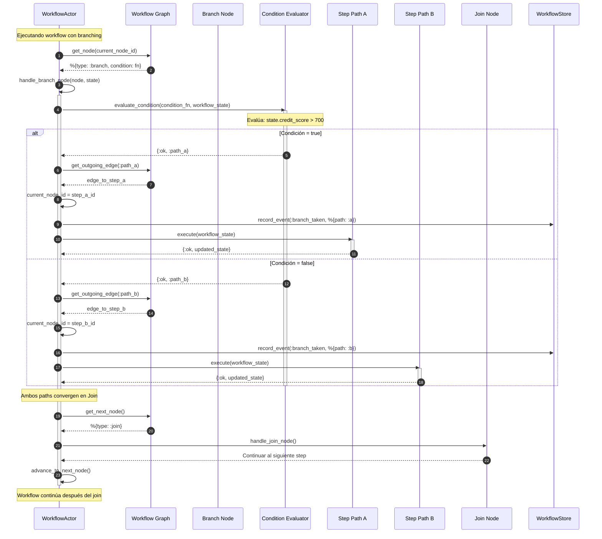
```mermaid
sequenceDiagram
    autonumber
    participant WA as WorkflowActor
    participant Graph as Workflow Graph
    participant Branch as Branch Node
    participant Cond as Condition Evaluator
    participant StepA as Step Path A
    participant StepB as Step Path B
    participant Join as Join Node
    participant Store as WorkflowStore

    Note over WA: Ejecutando workflow con branching
    
    WA->>Graph: get_node(current_node_id)
    Graph-->>WA: %{type: :branch, condition: fn}
    
    WA->>WA: handle_branch_node(node, state)
    activate WA
    
    WA->>Cond: evaluate_condition(condition_fn, workflow_state)
    activate Cond
    
    Note over Cond: Evalúa: state.credit_score > 700
    
    alt Condición = true
        Cond-->>WA: {:ok, :path_a}
        WA->>Graph: get_outgoing_edge(:path_a)
        Graph-->>WA: edge_to_step_a
        
        WA->>WA: current_node_id = step_a_id
        WA->>Store: record_event(:branch_taken, %{path: :a})
        
        WA->>StepA: execute(workflow_state)
        activate StepA
        StepA-->>WA: {:ok, updated_state}
        deactivate StepA
        
    else Condición = false
        Cond-->>WA: {:ok, :path_b}
        WA->>Graph: get_outgoing_edge(:path_b)
        Graph-->>WA: edge_to_step_b
        
        WA->>WA: current_node_id = step_b_id
        WA->>Store: record_event(:branch_taken, %{path: :b})
        
        WA->>StepB: execute(workflow_state)
        activate StepB
        StepB-->>WA: {:ok, updated_state}
        deactivate StepB
    end
    deactivate Cond
    
    Note over WA: Ambos paths convergen en Join
    
    WA->>Graph: get_next_node()
    Graph-->>WA: %{type: :join}
    
    WA->>Join: handle_join_node()
    Join-->>WA: Continuar al siguiente step
    
    WA->>WA: advance_to_next_node()
    deactivate WA
    
    Note over WA: Workflow continúa después del join
```

### Ejemplo: Workflow de Seguro con Branching

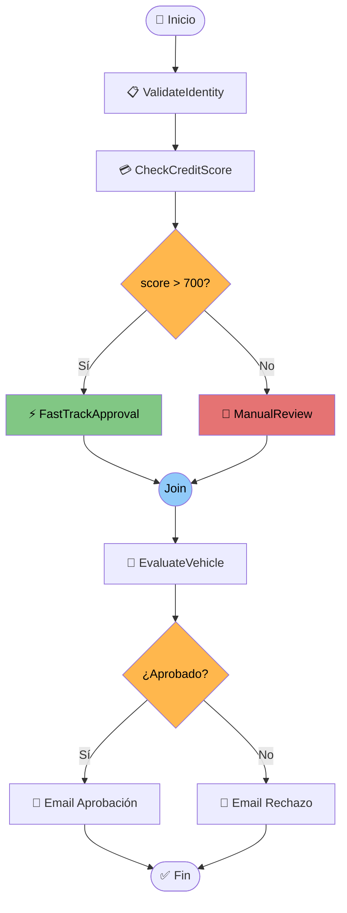
```mermaid
flowchart TD
    Start([🚀 Inicio]) --> Validate[📋 ValidateIdentity]
    Validate --> Credit[💳 CheckCreditScore]
    Credit --> Branch{score > 700?}
    
    Branch -->|Sí| FastTrack[⚡ FastTrackApproval]
    Branch -->|No| Manual[👤 ManualReview]
    
    FastTrack --> Join((Join))
    Manual --> Join
    
    Join --> Vehicle[🚗 EvaluateVehicle]
    Vehicle --> Decision{¿Aprobado?}
    
    Decision -->|Sí| EmailApproved[📧 Email Aprobación]
    Decision -->|No| EmailRejected[📧 Email Rechazo]
    
    EmailApproved --> End([✅ Fin])
    EmailRejected --> End
    
    style Branch fill:#FFB74D,color:black
    style Decision fill:#FFB74D,color:black
    style Join fill:#90CAF9,color:black
    style FastTrack fill:#81C784,color:black
    style Manual fill:#E57373,color:black
```

---

## 9. Validación de Idempotencia Detallada

Este diagrama muestra el flujo completo de validación de idempotencia, incluyendo todos los casos edge.

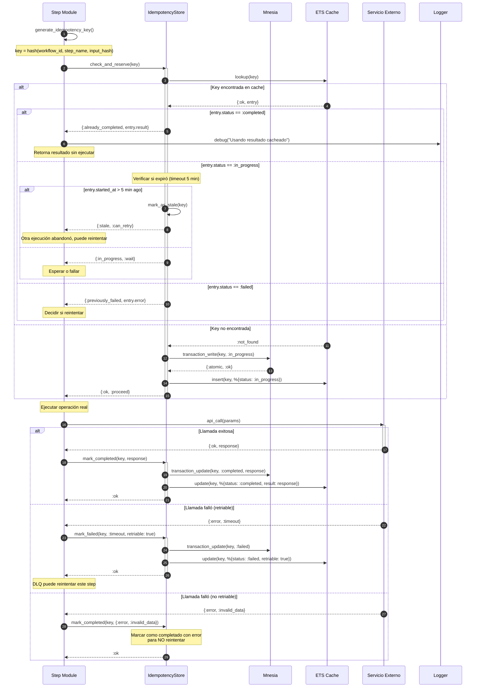
```mermaid
sequenceDiagram
    autonumber
    participant Step as Step Module
    participant Idem as IdempotencyStore
    participant Mnesia as Mnesia
    participant ETS as ETS Cache
    participant Ext as Servicio Externo
    participant Logger as Logger

    Step->>Step: generate_idempotency_key()
    Note over Step: key = hash(workflow_id, step_name, input_hash)
    
    Step->>Idem: check_and_reserve(key)
    activate Idem
    
    Idem->>ETS: lookup(key)
    
    alt Key encontrada en cache
        ETS-->>Idem: {:ok, entry}
        
        alt entry.status == :completed
            Idem-->>Step: {:already_completed, entry.result}
            Step->>Logger: debug("Usando resultado cacheado")
            Note over Step: Retorna resultado sin ejecutar
        
        else entry.status == :in_progress
            Note over Idem: Verificar si expiró (timeout 5 min)
            
            alt entry.started_at > 5 min ago
                Idem->>Idem: mark_as_stale(key)
                Idem-->>Step: {:stale, :can_retry}
                Note over Step: Otra ejecución abandonó, puede reintentar
            else
                Idem-->>Step: {:in_progress, :wait}
                Note over Step: Esperar o fallar
            end
        
        else entry.status == :failed
            Idem-->>Step: {:previously_failed, entry.error}
            Note over Step: Decidir si reintentar
        end
    
    else Key no encontrada
        ETS-->>Idem: :not_found
        
        Idem->>Mnesia: transaction_write(key, :in_progress)
        Mnesia-->>Idem: {:atomic, :ok}
        
        Idem->>ETS: insert(key, %{status: :in_progress})
        Idem-->>Step: {:ok, :proceed}
    end
    deactivate Idem
    
    Note over Step: Ejecutar operación real
    
    Step->>Ext: api_call(params)
    activate Ext
    
    alt Llamada exitosa
        Ext-->>Step: {:ok, response}
        deactivate Ext
        
        Step->>Idem: mark_completed(key, response)
        activate Idem
        Idem->>Mnesia: transaction_update(key, :completed, response)
        Idem->>ETS: update(key, %{status: :completed, result: response})
        Idem-->>Step: :ok
        deactivate Idem
        
    else Llamada falló (retriable)
        Ext-->>Step: {:error, :timeout}
        
        Step->>Idem: mark_failed(key, :timeout, retriable: true)
        activate Idem
        Idem->>Mnesia: transaction_update(key, :failed)
        Idem->>ETS: update(key, %{status: :failed, retriable: true})
        Idem-->>Step: :ok
        deactivate Idem
        
        Note over Step: DLQ puede reintentar este step
        
    else Llamada falló (no retriable)
        Ext-->>Step: {:error, :invalid_data}
        
        Step->>Idem: mark_completed(key, {:error, :invalid_data})
        Note over Idem: Marcar como completado con error<br/>para NO reintentar
        Idem-->>Step: :ok
    end
```

### Estados de Idempotencia

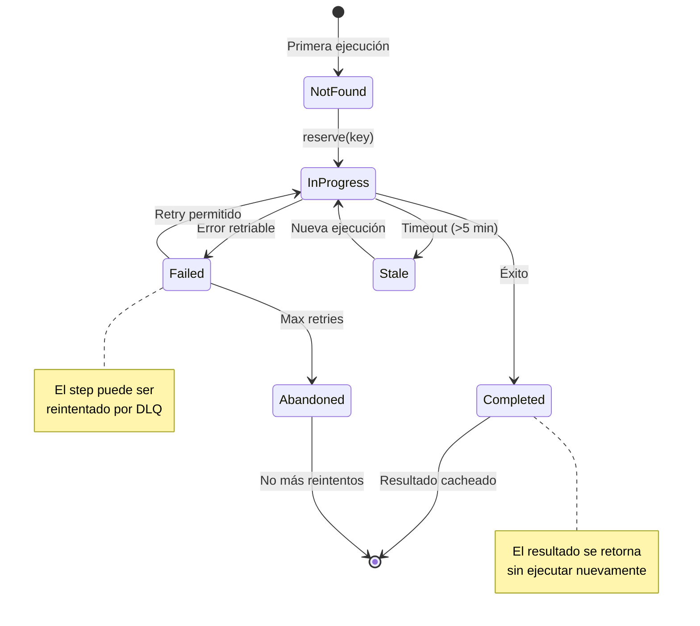
```mermaid
stateDiagram-v2
    [*] --> NotFound: Primera ejecución
    
    NotFound --> InProgress: reserve(key)
    
    InProgress --> Completed: Éxito
    InProgress --> Failed: Error retriable
    InProgress --> Stale: Timeout (>5 min)
    
    Completed --> [*]: Resultado cacheado
    
    Failed --> InProgress: Retry permitido
    Failed --> Abandoned: Max retries
    
    Stale --> InProgress: Nueva ejecución
    
    Abandoned --> [*]: No más reintentos
    
    note right of Completed
        El resultado se retorna
        sin ejecutar nuevamente
    end note
    
    note right of Failed
        El step puede ser
        reintentado por DLQ
    end note
```

---

## 10. Interfaz de Usuario - Workflow Explorer

Este diagrama muestra el flujo de interacción del usuario con la vista principal de exploración de workflows.

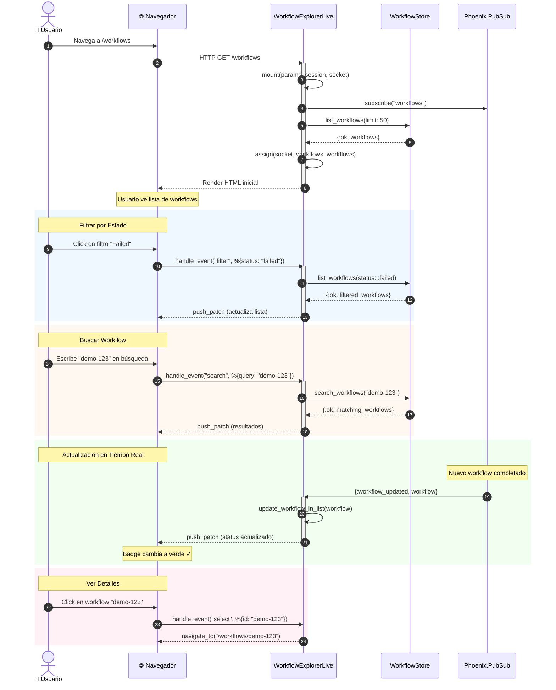
```mermaid
sequenceDiagram
    autonumber
    actor User as 👤 Usuario
    participant Browser as 🌐 Navegador
    participant Explorer as WorkflowExplorerLive
    participant Store as WorkflowStore
    participant PubSub as Phoenix.PubSub

    User->>Browser: Navega a /workflows
    Browser->>Explorer: HTTP GET /workflows
    
    activate Explorer
    Explorer->>Explorer: mount(params, session, socket)
    Explorer->>PubSub: subscribe("workflows")
    Explorer->>Store: list_workflows(limit: 50)
    Store-->>Explorer: {:ok, workflows}
    
    Explorer->>Explorer: assign(socket, workflows: workflows)
    Explorer-->>Browser: Render HTML inicial
    deactivate Explorer
    
    Note over Browser: Usuario ve lista de workflows
    
    rect rgb(240, 248, 255)
        Note over User,Browser: Filtrar por Estado
        User->>Browser: Click en filtro "Failed"
        Browser->>Explorer: handle_event("filter", %{status: "failed"})
        activate Explorer
        Explorer->>Store: list_workflows(status: :failed)
        Store-->>Explorer: {:ok, filtered_workflows}
        Explorer-->>Browser: push_patch (actualiza lista)
        deactivate Explorer
    end
    
    rect rgb(255, 248, 240)
        Note over User,Browser: Buscar Workflow
        User->>Browser: Escribe "demo-123" en búsqueda
        Browser->>Explorer: handle_event("search", %{query: "demo-123"})
        activate Explorer
        Explorer->>Store: search_workflows("demo-123")
        Store-->>Explorer: {:ok, matching_workflows}
        Explorer-->>Browser: push_patch (resultados)
        deactivate Explorer
    end
    
    rect rgb(240, 255, 240)
        Note over User,Browser: Actualización en Tiempo Real
        Note over PubSub: Nuevo workflow completado
        PubSub->>Explorer: {:workflow_updated, workflow}
        activate Explorer
        Explorer->>Explorer: update_workflow_in_list(workflow)
        Explorer-->>Browser: push_patch (status actualizado)
        deactivate Explorer
        Note over Browser: Badge cambia a verde ✓
    end
    
    rect rgb(255, 240, 245)
        Note over User,Browser: Ver Detalles
        User->>Browser: Click en workflow "demo-123"
        Browser->>Explorer: handle_event("select", %{id: "demo-123"})
        Explorer-->>Browser: navigate_to("/workflows/demo-123")
    end
```

### Wireframe: Workflow Explorer

```
┌─────────────────────────────────────────────────────────────────────────────┐
│  🔷 BeamFlow                                              [Chaos: Gentle ▼] │
├─────────────────────────────────────────────────────────────────────────────┤
│                                                                             │
│  ┌─ Workflows ─────────────────────────────────────────────────────────────┐│
│  │                                                                         ││
│  │  [🔍 Buscar workflow...]          [All ▼] [Estado ▼] [📅 Fecha ▼]       ││
│  │                                                                         ││
│  │  ┌─────────────────────────────────────────────────────────────────────┐││
│  │  │ ID            │ Módulo          │ Estado    │ Steps │ Iniciado     │││
│  │  ├─────────────────────────────────────────────────────────────────────┤││
│  │  │ demo-123456   │ InsuranceWflow  │ 🟢 Done   │ 5/5   │ 10:30:15     │││
│  │  │ demo-789012   │ InsuranceWflow  │ 🔵 Running│ 3/5   │ 10:31:22     │││
│  │  │ demo-345678   │ InsuranceWflow  │ 🔴 Failed │ 2/5   │ 10:29:45     │││
│  │  │ demo-901234   │ InsuranceWflow  │ 🟡 Pending│ 0/5   │ 10:32:01     │││
│  │  │ ...           │ ...             │ ...       │ ...   │ ...          │││
│  │  └─────────────────────────────────────────────────────────────────────┘││
│  │                                                                         ││
│  │  Mostrando 25 de 150 workflows          [◀ Anterior] [Siguiente ▶]     ││
│  │                                                                         ││
│  └─────────────────────────────────────────────────────────────────────────┘│
│                                                                             │
│  ┌─ Estadísticas ──────────────────────────────────────────────────────────┐│
│  │   ✓ Completados: 120   ⏳ En progreso: 15   ✗ Fallidos: 10   📋 DLQ: 5  ││
│  └─────────────────────────────────────────────────────────────────────────┘│
│                                                                             │
└─────────────────────────────────────────────────────────────────────────────┘
```

---

## 11. Interfaz de Usuario - Workflow Graph (Detalle)

Este diagrama muestra la interacción del usuario con la visualización gráfica de un workflow individual.

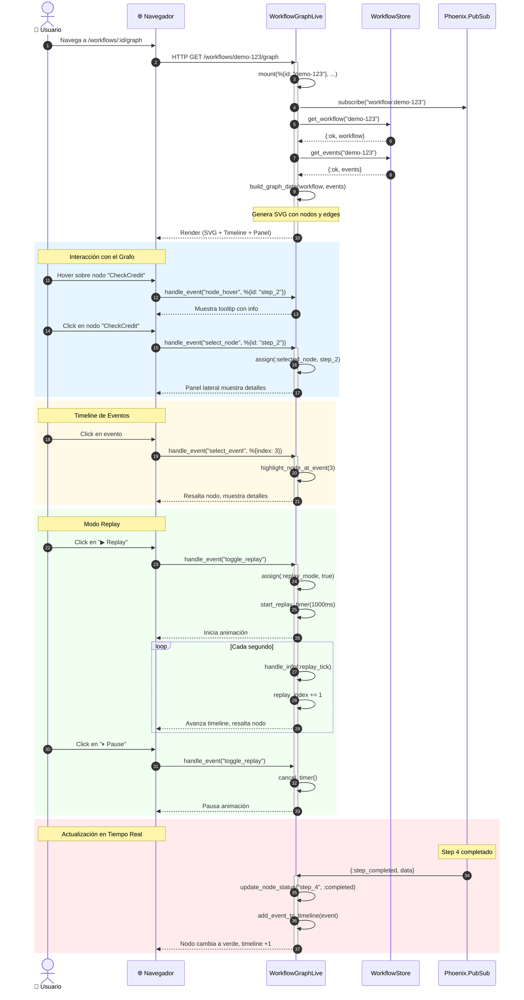
```mermaid
sequenceDiagram
    autonumber
    actor User as 👤 Usuario
    participant Browser as 🌐 Navegador
    participant GraphLive as WorkflowGraphLive
    participant Store as WorkflowStore
    participant PubSub as Phoenix.PubSub

    User->>Browser: Navega a /workflows/:id/graph
    Browser->>GraphLive: HTTP GET /workflows/demo-123/graph
    
    activate GraphLive
    GraphLive->>GraphLive: mount(%{id: "demo-123"}, ...)
    GraphLive->>PubSub: subscribe("workflow:demo-123")
    GraphLive->>Store: get_workflow("demo-123")
    Store-->>GraphLive: {:ok, workflow}
    GraphLive->>Store: get_events("demo-123")
    Store-->>GraphLive: {:ok, events}
    
    GraphLive->>GraphLive: build_graph_data(workflow, events)
    Note over GraphLive: Genera SVG con nodos y edges
    
    GraphLive-->>Browser: Render (SVG + Timeline + Panel)
    deactivate GraphLive
    
    rect rgb(230, 245, 255)
        Note over User,Browser: Interacción con el Grafo
        
        User->>Browser: Hover sobre nodo "CheckCredit"
        Browser->>GraphLive: handle_event("node_hover", %{id: "step_2"})
        GraphLive-->>Browser: Muestra tooltip con info
        
        User->>Browser: Click en nodo "CheckCredit"
        Browser->>GraphLive: handle_event("select_node", %{id: "step_2"})
        activate GraphLive
        GraphLive->>GraphLive: assign(:selected_node, step_2)
        GraphLive-->>Browser: Panel lateral muestra detalles
        deactivate GraphLive
    end
    
    rect rgb(255, 250, 230)
        Note over User,Browser: Timeline de Eventos
        
        User->>Browser: Click en evento #3 del timeline
        Browser->>GraphLive: handle_event("select_event", %{index: 3})
        activate GraphLive
        GraphLive->>GraphLive: highlight_node_at_event(3)
        GraphLive-->>Browser: Resalta nodo, muestra detalles
        deactivate GraphLive
    end
    
    rect rgb(240, 255, 240)
        Note over User,Browser: Modo Replay
        
        User->>Browser: Click en "▶ Replay"
        Browser->>GraphLive: handle_event("toggle_replay")
        activate GraphLive
        GraphLive->>GraphLive: assign(:replay_mode, true)
        GraphLive->>GraphLive: start_replay_timer(1000ms)
        GraphLive-->>Browser: Inicia animación
        
        loop Cada segundo
            GraphLive->>GraphLive: handle_info(:replay_tick)
            GraphLive->>GraphLive: replay_index += 1
            GraphLive-->>Browser: Avanza timeline, resalta nodo
        end
        
        User->>Browser: Click en "⏸ Pause"
        Browser->>GraphLive: handle_event("toggle_replay")
        GraphLive->>GraphLive: cancel_timer()
        GraphLive-->>Browser: Pausa animación
        deactivate GraphLive
    end
    
    rect rgb(255, 235, 235)
        Note over User,Browser: Actualización en Tiempo Real
        
        Note over PubSub: Step 4 completado
        PubSub->>GraphLive: {:step_completed, data}
        activate GraphLive
        GraphLive->>GraphLive: update_node_status("step_4", :completed)
        GraphLive->>GraphLive: add_event_to_timeline(event)
        GraphLive-->>Browser: Nodo cambia a verde, timeline +1
        deactivate GraphLive
    end
```

### Wireframe: Workflow Graph View

```
┌─────────────────────────────────────────────────────────────────────────────┐
│  🔷 BeamFlow  >  Workflows  >  demo-123456                    [← Volver]   │
├─────────────────────────────────────────────────────────────────────────────┤
│                                                                             │
│  ┌─ Grafo del Workflow ──────────────────────┐  ┌─ Detalles ──────────────┐│
│  │                                           │  │                         ││
│  │     ┌─────────┐                           │  │  📋 CheckCreditScore    ││
│  │     │ START   │                           │  │  ─────────────────────  ││
│  │     └────┬────┘                           │  │                         ││
│  │          │                                │  │  Estado: 🟢 Completed   ││
│  │          ▼                                │  │  Duración: 234ms        ││
│  │     ┌─────────┐                           │  │  Iniciado: 10:30:16     ││
│  │     │Validate │ 🟢                        │  │  Terminado: 10:30:16    ││
│  │     │Identity │                           │  │                         ││
│  │     └────┬────┘                           │  │  📊 Resultado:          ││
│  │          │                                │  │  ┌───────────────────┐  ││
│  │          ▼                                │  │  │ score: 750        │  ││
│  │     ┌─────────┐                           │  │  │ risk: "low"       │  ││
│  │     │ Check   │ 🔵 ← seleccionado         │  │  │ provider: "bureau"│  ││
│  │     │ Credit  │                           │  │  └───────────────────┘  ││
│  │     └────┬────┘                           │  │                         ││
│  │          │                                │  │  🔄 Idempotency Key:    ││
│  │          ▼                                │  │  idem_demo123_credit_   ││
│  │     ┌─────────┐                           │  │  a1b2c3d4               ││
│  │     │Evaluate │ 🟡                        │  │                         ││
│  │     │Vehicle  │                           │  └─────────────────────────┘│
│  │     └────┬────┘                           │                             │
│  │          │                                │                             │
│  │          ▼                                │                             │
│  │     ┌─────────┐                           │                             │
│  │     │ END     │                           │                             │
│  │     └─────────┘                           │                             │
│  │                                           │                             │
│  └───────────────────────────────────────────┘                             │
│                                                                             │
│  ┌─ Timeline ───────────────────────────────────────────────────────────────┐
│  │ [▶ Replay] [⏸] [◀◀] [▶▶] [1x ▼]                     Evento 3 de 8      │
│  │                                                                         │
│  │  ●────────●────────●────────○────────○────────○────────○────────○       │
│  │  Start   Valid.   Credit   Eval.    ...                                 │
│  │  10:30:15 10:30:15 10:30:16                                             │
│  │                    ▲                                                    │
│  │                    └─ Seleccionado                                      │
│  └─────────────────────────────────────────────────────────────────────────┘
│                                                                             │
└─────────────────────────────────────────────────────────────────────────────┘
```

---

## 12. Interfaz de Usuario - Dead Letter Queue

Este diagrama muestra la interacción del usuario con la gestión del DLQ.

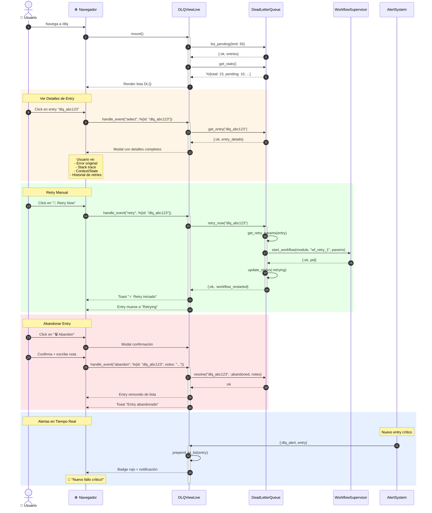
```mermaid
sequenceDiagram
    autonumber
    actor User as 👤 Usuario
    participant Browser as 🌐 Navegador  
    participant DLQView as DLQViewLive
    participant DLQ as DeadLetterQueue
    participant WS as WorkflowSupervisor
    participant Alert as AlertSystem

    User->>Browser: Navega a /dlq
    Browser->>DLQView: mount()
    
    activate DLQView
    DLQView->>DLQ: list_pending(limit: 50)
    DLQ-->>DLQView: {:ok, entries}
    DLQView->>DLQ: get_stats()
    DLQ-->>DLQView: %{total: 15, pending: 10, ...}
    DLQView-->>Browser: Render lista DLQ
    deactivate DLQView
    
    rect rgb(255, 245, 230)
        Note over User,Browser: Ver Detalles de Entry
        
        User->>Browser: Click en entry "dlq_abc123"
        Browser->>DLQView: handle_event("select", %{id: "dlq_abc123"})
        activate DLQView
        DLQView->>DLQ: get_entry("dlq_abc123")
        DLQ-->>DLQView: {:ok, entry_details}
        DLQView-->>Browser: Modal con detalles completos
        deactivate DLQView
        
        Note over Browser: Usuario ve:<br/>- Error original<br/>- Stack trace<br/>- Context/State<br/>- Historial de retries
    end
    
    rect rgb(230, 255, 230)
        Note over User,Browser: Retry Manual
        
        User->>Browser: Click en "🔄 Retry Now"
        Browser->>DLQView: handle_event("retry", %{id: "dlq_abc123"})
        activate DLQView
        
        DLQView->>DLQ: retry_now("dlq_abc123")
        activate DLQ
        DLQ->>DLQ: get_retry_params(entry)
        DLQ->>WS: start_workflow(module, "wf_retry_1", params)
        WS-->>DLQ: {:ok, pid}
        DLQ->>DLQ: update_status(:retrying)
        DLQ-->>DLQView: {:ok, :workflow_restarted}
        deactivate DLQ
        
        DLQView-->>Browser: Toast "✓ Retry iniciado"
        DLQView-->>Browser: Entry mueve a "Retrying"
        deactivate DLQView
    end
    
    rect rgb(255, 230, 230)
        Note over User,Browser: Abandonar Entry
        
        User->>Browser: Click en "🗑 Abandon"
        Browser->>DLQView: Modal confirmación
        User->>Browser: Confirma + escribe nota
        Browser->>DLQView: handle_event("abandon", %{id: "dlq_abc123", notes: "..."})
        
        activate DLQView
        DLQView->>DLQ: resolve("dlq_abc123", :abandoned, notes)
        DLQ-->>DLQView: :ok
        DLQView-->>Browser: Entry removido de lista
        DLQView-->>Browser: Toast "Entry abandonado"
        deactivate DLQView
    end
    
    rect rgb(230, 240, 255)
        Note over User,Browser: Alertas en Tiempo Real
        
        Note over Alert: Nuevo entry crítico
        Alert->>DLQView: {:dlq_alert, entry}
        activate DLQView
        DLQView->>DLQView: prepend_to_list(entry)
        DLQView-->>Browser: Badge rojo + notificación
        Note over Browser: 🔴 "Nuevo fallo crítico!"
        deactivate DLQView
    end
```

### Wireframe: Dead Letter Queue

```
┌─────────────────────────────────────────────────────────────────────────────┐
│  🔷 BeamFlow  >  Dead Letter Queue                        [🔔 3 alertas]   │
├─────────────────────────────────────────────────────────────────────────────┤
│                                                                             │
│  ┌─ Estadísticas ──────────────────────────────────────────────────────────┐│
│  │   📬 Total: 15   ⏳ Pendientes: 10   🔄 Reintentando: 3   ✓ Resueltos: 2││
│  └─────────────────────────────────────────────────────────────────────────┘│
│                                                                             │
│  ┌─ Entries Pendientes ────────────────────────────────────────────────────┐│
│  │                                                                         ││
│  │  [Filtrar: All ▼]  [Tipo: All ▼]  [Ordenar: Más reciente ▼]            ││
│  │                                                                         ││
│  │  ┌─────────────────────────────────────────────────────────────────────┐││
│  │  │ 🔴 dlq_abc123                                      [🔄] [👁] [🗑]   │││
│  │  │ Workflow: demo-789012 | Step: CheckCreditScore                      │││
│  │  │ Error: :service_unavailable | Retries: 2/5 | Next: 14:35:00        │││
│  │  ├─────────────────────────────────────────────────────────────────────┤││
│  │  │ 🟠 dlq_def456                                      [🔄] [👁] [🗑]   │││
│  │  │ Workflow: demo-345678 | Step: ValidateIdentity                      │││
│  │  │ Error: :invalid_dni | Retries: 5/5 ⚠️ MAX | Created: 10:15:00      │││
│  │  ├─────────────────────────────────────────────────────────────────────┤││
│  │  │ 🟡 dlq_ghi789                                      [🔄] [👁] [🗑]   │││
│  │  │ Workflow: demo-901234 | Step: SendEmail                             │││
│  │  │ Error: :smtp_timeout | Retries: 1/5 | Next: 14:32:00               │││
│  │  └─────────────────────────────────────────────────────────────────────┘││
│  │                                                                         ││
│  └─────────────────────────────────────────────────────────────────────────┘│
│                                                                             │
│  ┌─ Acciones Masivas ──────────────────────────────────────────────────────┐│
│  │   [☐ Seleccionar todos]  [🔄 Retry Seleccionados]  [🗑 Abandonar]       ││
│  └─────────────────────────────────────────────────────────────────────────┘│
│                                                                             │
└─────────────────────────────────────────────────────────────────────────────┘

┌─ Modal: Detalles de Entry ─────────────────────────────────────────────────┐
│                                                                     [✕]    │
│  📋 Entry: dlq_abc123                                                      │
│  ───────────────────────────────────────────────────────────────────────   │
│                                                                            │
│  Workflow ID: demo-789012                                                  │
│  Módulo: Beamflow.Domains.Insurance.InsuranceWorkflow                      │
│  Step Fallido: CheckCreditScore                                            │
│  Tipo: :workflow_failed                                                    │
│                                                                            │
│  ┌─ Error ──────────────────────────────────────────────────────────────┐  │
│  │ {:error, :service_unavailable}                                       │  │
│  │                                                                      │  │
│  │ Stacktrace:                                                          │  │
│  │   (beamflow) lib/beamflow/domains/insurance/steps/check_credit.ex:45 │  │
│  │   (beamflow) lib/beamflow/engine/workflow_actor.ex:312               │  │
│  └──────────────────────────────────────────────────────────────────────┘  │
│                                                                            │
│  ┌─ Context (State al momento del fallo) ───────────────────────────────┐  │
│  │ %{                                                                   │  │
│  │   dni: "12345678",                                                   │  │
│  │   applicant_name: "Juan Pérez",                                      │  │
│  │   identity_verified: true,                                           │  │
│  │   ...                                                                │  │
│  │ }                                                                    │  │
│  └──────────────────────────────────────────────────────────────────────┘  │
│                                                                            │
│  ┌─ Historial de Retries ───────────────────────────────────────────────┐  │
│  │ #1: 14:20:00 - Failed (:service_unavailable)                         │  │
│  │ #2: 14:22:00 - Failed (:service_unavailable)                         │  │
│  │ #3: Próximo intento: 14:26:00                                        │  │
│  └──────────────────────────────────────────────────────────────────────┘  │
│                                                                            │
│  [🔄 Retry Ahora]  [✓ Marcar Resuelto]  [🗑 Abandonar]  [Cerrar]          │
│                                                                            │
└────────────────────────────────────────────────────────────────────────────┘
```

---

## 13. Flujo Completo de Usuario - Demo

Este diagrama muestra el flujo típico de un usuario explorando el sistema.

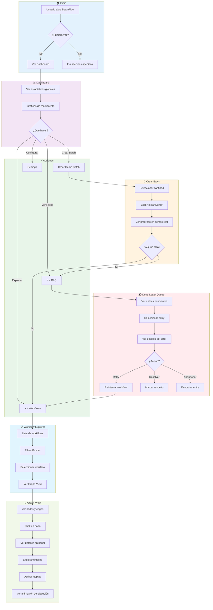
```mermaid
flowchart TD
    subgraph Inicio["🏠 Inicio"]
        A[Usuario abre BeamFlow] --> B{¿Primera vez?}
        B -->|Sí| C[Ver Dashboard]
        B -->|No| D[Ir a sección específica]
    end
    
    subgraph Dashboard["📊 Dashboard"]
        C --> E[Ver estadísticas globales]
        E --> F[Gráficos de rendimiento]
        F --> G{¿Qué hacer?}
    end
    
    subgraph Acciones["⚡ Acciones"]
        G -->|Crear Batch| H[Crear Demo Batch]
        G -->|Explorar| I[Ir a Workflows]
        G -->|Ver Fallos| J[Ir a DLQ]
        G -->|Configurar| K[Settings]
    end
    
    subgraph CreateBatch["🎯 Crear Batch"]
        H --> L[Seleccionar cantidad]
        L --> M[Click 'Iniciar Demo']
        M --> N[Ver progreso en tiempo real]
        N --> O{¿Alguno falló?}
        O -->|Sí| J
        O -->|No| I
    end
    
    subgraph Workflows["📋 Workflow Explorer"]
        I --> P[Lista de workflows]
        P --> Q[Filtrar/Buscar]
        Q --> R[Seleccionar workflow]
        R --> S[Ver Graph View]
    end
    
    subgraph GraphView["🔷 Graph View"]
        S --> T[Ver nodos y edges]
        T --> U[Click en nodo]
        U --> V[Ver detalles en panel]
        V --> W[Explorar timeline]
        W --> X[Activar Replay]
        X --> Y[Ver animación de ejecución]
    end
    
    subgraph DLQView["📬 Dead Letter Queue"]
        J --> Z[Ver entries pendientes]
        Z --> AA[Seleccionar entry]
        AA --> AB[Ver detalles del error]
        AB --> AC{¿Acción?}
        AC -->|Retry| AD[Reintentar workflow]
        AC -->|Resolver| AE[Marcar resuelto]
        AC -->|Abandonar| AF[Descartar entry]
        AD --> I
    end
    
    style Inicio fill:#E3F2FD
    style Dashboard fill:#F3E5F5
    style Acciones fill:#E8F5E9
    style CreateBatch fill:#FFF3E0
    style Workflows fill:#E1F5FE
    style GraphView fill:#F1F8E9
    style DLQView fill:#FFEBEE
```

---

## 14. API REST - Endpoints para Integración Externa

Este diagrama muestra los endpoints disponibles para integrar BeamFlow con sistemas externos.

### Arquitectura de la API

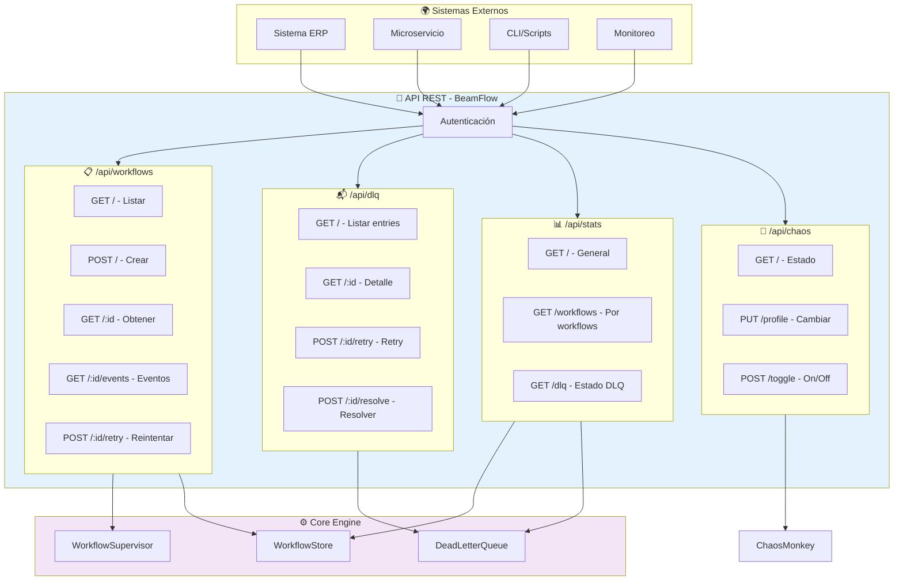
```mermaid
flowchart TB
    subgraph External["🌍 Sistemas Externos"]
        Client1[Sistema ERP]
        Client2[Microservicio]
        Client3[CLI/Scripts]
        Client4[Monitoreo]
    end
    
    subgraph API["🔌 API REST - BeamFlow"]
        Auth[Autenticación]
        
        subgraph Workflows["📋 /api/workflows"]
            WList[GET / - Listar]
            WCreate[POST / - Crear]
            WGet[GET /:id - Obtener]
            WEvents[GET /:id/events - Eventos]
            WRetry[POST /:id/retry - Reintentar]
        end
        
        subgraph DLQ["📬 /api/dlq"]
            DList[GET / - Listar entries]
            DGet[GET /:id - Detalle]
            DRetry[POST /:id/retry - Retry]
            DResolve[POST /:id/resolve - Resolver]
        end
        
        subgraph Stats["📊 /api/stats"]
            SOverview[GET / - General]
            SWorkflows[GET /workflows - Por workflows]
            SDLQ[GET /dlq - Estado DLQ]
        end
        
        subgraph Chaos["🐒 /api/chaos"]
            CStatus[GET / - Estado]
            CProfile[PUT /profile - Cambiar]
            CToggle[POST /toggle - On/Off]
        end
    end
    
    subgraph Core["⚙️ Core Engine"]
        WS[WorkflowSupervisor]
        DLQService[DeadLetterQueue]
        Store[WorkflowStore]
    end
    
    Client1 --> Auth
    Client2 --> Auth
    Client3 --> Auth
    Client4 --> Auth
    
    Auth --> Workflows
    Auth --> DLQ
    Auth --> Stats
    Auth --> Chaos
    
    Workflows --> WS
    Workflows --> Store
    DLQ --> DLQService
    Stats --> Store
    Stats --> DLQService
    Chaos --> ChaosMonkey
    
    style API fill:#E3F2FD
    style Core fill:#F3E5F5
```

### Flujo: Crear Workflow vía API

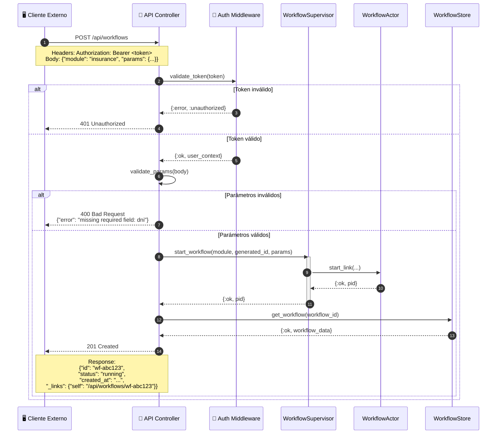
```mermaid
sequenceDiagram
    autonumber
    participant Client as 🖥️ Cliente Externo
    participant API as 🔌 API Controller
    participant Auth as 🔐 Auth Middleware
    participant WS as WorkflowSupervisor
    participant WA as WorkflowActor
    participant Store as WorkflowStore

    Client->>API: POST /api/workflows
    Note over Client,API: Headers: Authorization: Bearer <token><br/>Body: {"module": "insurance", "params": {...}}
    
    API->>Auth: validate_token(token)
    
    alt Token inválido
        Auth-->>API: {:error, :unauthorized}
        API-->>Client: 401 Unauthorized
    else Token válido
        Auth-->>API: {:ok, user_context}
        
        API->>API: validate_params(body)
        
        alt Parámetros inválidos
            API-->>Client: 400 Bad Request<br/>{"error": "missing required field: dni"}
        else Parámetros válidos
            API->>WS: start_workflow(module, generated_id, params)
            activate WS
            
            WS->>WA: start_link(...)
            WA-->>WS: {:ok, pid}
            WS-->>API: {:ok, pid}
            deactivate WS
            
            API->>Store: get_workflow(workflow_id)
            Store-->>API: {:ok, workflow_data}
            
            API-->>Client: 201 Created
            Note over API,Client: Response:<br/>{"id": "wf-abc123",<br/>"status": "running",<br/>"created_at": "...",<br/>"_links": {"self": "/api/workflows/wf-abc123"}}
        end
    end
```

### Flujo: Consultar Estado de Workflow

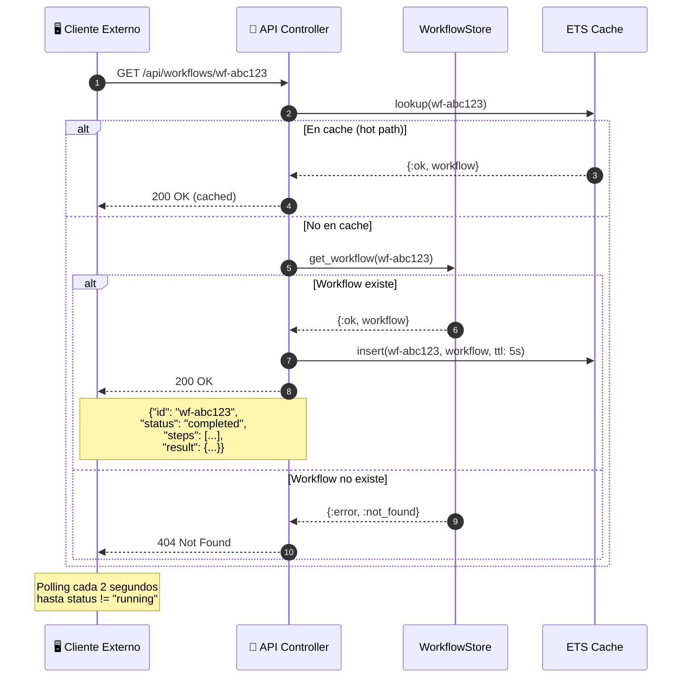
```mermaid
sequenceDiagram
    autonumber
    participant Client as 🖥️ Cliente Externo
    participant API as 🔌 API Controller
    participant Store as WorkflowStore
    participant Cache as ETS Cache

    Client->>API: GET /api/workflows/wf-abc123
    
    API->>Cache: lookup(wf-abc123)
    
    alt En cache (hot path)
        Cache-->>API: {:ok, workflow}
        API-->>Client: 200 OK (cached)
    else No en cache
        API->>Store: get_workflow(wf-abc123)
        
        alt Workflow existe
            Store-->>API: {:ok, workflow}
            API->>Cache: insert(wf-abc123, workflow, ttl: 5s)
            API-->>Client: 200 OK
            Note over API,Client: {"id": "wf-abc123",<br/>"status": "completed",<br/>"steps": [...],<br/>"result": {...}}
        else Workflow no existe
            Store-->>API: {:error, :not_found}
            API-->>Client: 404 Not Found
        end
    end

    Note over Client: Polling cada 2 segundos<br/>hasta status != "running"
```

### Flujo: Webhook de Notificaciones

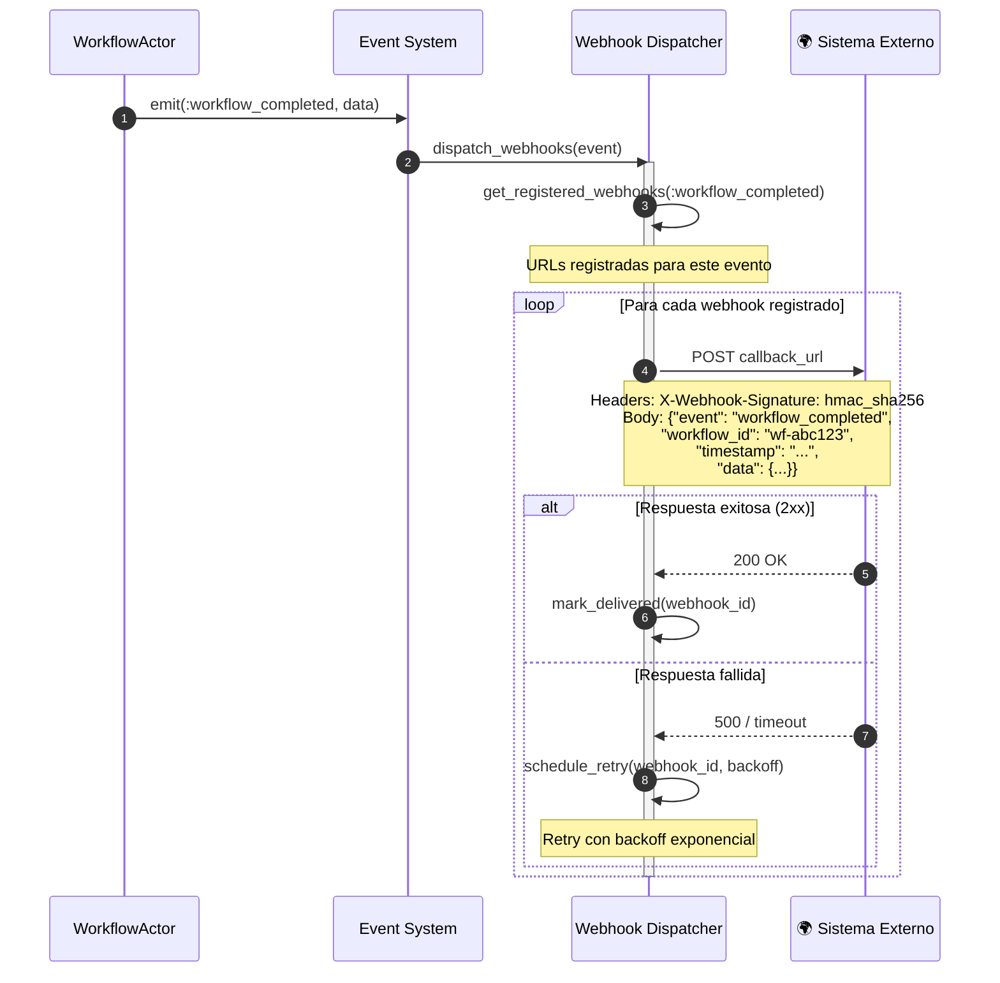
```mermaid
sequenceDiagram
    autonumber
    participant WA as WorkflowActor
    participant Events as Event System
    participant Webhook as Webhook Dispatcher
    participant External as 🌍 Sistema Externo

    WA->>Events: emit(:workflow_completed, data)
    
    Events->>Webhook: dispatch_webhooks(event)
    activate Webhook
    
    Webhook->>Webhook: get_registered_webhooks(:workflow_completed)
    Note over Webhook: URLs registradas para este evento
    
    loop Para cada webhook registrado
        Webhook->>External: POST callback_url
        Note over Webhook,External: Headers: X-Webhook-Signature: hmac_sha256<br/>Body: {"event": "workflow_completed",<br/>"workflow_id": "wf-abc123",<br/>"timestamp": "...",<br/>"data": {...}}
        
        alt Respuesta exitosa (2xx)
            External-->>Webhook: 200 OK
            Webhook->>Webhook: mark_delivered(webhook_id)
        else Respuesta fallida
            External-->>Webhook: 500 / timeout
            Webhook->>Webhook: schedule_retry(webhook_id, backoff)
            Note over Webhook: Retry con backoff exponencial
        end
    end
    deactivate Webhook
```

### Referencia de Endpoints API

```
┌─────────────────────────────────────────────────────────────────────────────┐
│                        📚 API REST - BeamFlow v1                            │
├─────────────────────────────────────────────────────────────────────────────┤
│                                                                             │
│  Base URL: http://localhost:4000/api                                        │
│  Auth: Bearer Token (header Authorization)                                  │
│                                                                             │
│  ════════════════════════════════════════════════════════════════════════   │
│  📋 WORKFLOWS                                                               │
│  ════════════════════════════════════════════════════════════════════════   │
│                                                                             │
│  GET    /workflows              Lista workflows (paginado)                  │
│         ?status=running         Filtrar por estado                          │
│         ?limit=50&offset=0      Paginación                                  │
│         ?from=2024-01-01        Desde fecha                                 │
│                                                                             │
│  POST   /workflows              Crear nuevo workflow                        │
│         Body: {                                                             │
│           "module": "insurance",                                            │
│           "params": {"dni": "12345678", ...}                                │
│         }                                                                   │
│                                                                             │
│  GET    /workflows/:id          Obtener workflow específico                 │
│                                                                             │
│  GET    /workflows/:id/events   Obtener eventos del workflow                │
│         ?type=step_completed    Filtrar por tipo                            │
│                                                                             │
│  POST   /workflows/:id/retry    Reintentar workflow fallido                 │
│                                                                             │
│  DELETE /workflows/:id          Cancelar workflow en ejecución              │
│                                                                             │
│  ════════════════════════════════════════════════════════════════════════   │
│  📬 DEAD LETTER QUEUE                                                       │
│  ════════════════════════════════════════════════════════════════════════   │
│                                                                             │
│  GET    /dlq                    Listar entries del DLQ                      │
│         ?status=pending         Filtrar por estado                          │
│         ?type=workflow_failed   Filtrar por tipo                            │
│                                                                             │
│  GET    /dlq/:id                Obtener detalle de entry                    │
│                                                                             │
│  POST   /dlq/:id/retry          Forzar retry de entry                       │
│                                                                             │
│  POST   /dlq/:id/resolve        Marcar como resuelto                        │
│         Body: {"resolution": "fixed", "notes": "..."}                       │
│                                                                             │
│  POST   /dlq/:id/abandon        Abandonar entry                             │
│         Body: {"reason": "invalid_data", "notes": "..."}                    │
│                                                                             │
│  ════════════════════════════════════════════════════════════════════════   │
│  📊 ESTADÍSTICAS                                                            │
│  ════════════════════════════════════════════════════════════════════════   │
│                                                                             │
│  GET    /stats                  Estadísticas generales                      │
│                                                                             │
│  GET    /stats/workflows        Métricas de workflows                       │
│         Response: {                                                         │
│           "total": 1500,                                                    │
│           "completed": 1200,                                                │
│           "failed": 50,                                                     │
│           "avg_duration_ms": 2340                                           │
│         }                                                                   │
│                                                                             │
│  GET    /stats/dlq              Estado del DLQ                              │
│                                                                             │
│  ════════════════════════════════════════════════════════════════════════   │
│  🐒 CHAOS MONKEY                                                            │
│  ════════════════════════════════════════════════════════════════════════   │
│                                                                             │
│  GET    /chaos                  Estado actual de ChaosMonkey                │
│                                                                             │
│  PUT    /chaos/profile          Cambiar perfil                              │
│         Body: {"profile": "moderate"}                                       │
│                                                                             │
│  POST   /chaos/toggle           Activar/desactivar                          │
│                                                                             │
│  ════════════════════════════════════════════════════════════════════════   │
│  🔔 WEBHOOKS                                                                │
│  ════════════════════════════════════════════════════════════════════════   │
│                                                                             │
│  GET    /webhooks               Listar webhooks registrados                 │
│                                                                             │
│  POST   /webhooks               Registrar nuevo webhook                     │
│         Body: {                                                             │
│           "url": "https://example.com/callback",                            │
│           "events": ["workflow_completed", "workflow_failed"],              │
│           "secret": "my_secret_key"                                         │
│         }                                                                   │
│                                                                             │
│  DELETE /webhooks/:id           Eliminar webhook                            │
│                                                                             │
└─────────────────────────────────────────────────────────────────────────────┘
```

### Códigos de Respuesta

| Código | Significado | Cuándo ocurre |
|--------|-------------|---------------|
| 200 | OK | Operación exitosa |
| 201 | Created | Workflow/webhook creado |
| 400 | Bad Request | Parámetros inválidos |
| 401 | Unauthorized | Token inválido o ausente |
| 404 | Not Found | Recurso no existe |
| 409 | Conflict | Workflow ya existe con ese ID |
| 422 | Unprocessable | Validación de negocio falló |
| 429 | Too Many Requests | Rate limit excedido |
| 500 | Internal Error | Error del servidor |

---

## 15. Caminos de Error en UX - Recuperación de Usuario

Este diagrama muestra qué pasa cuando un usuario se pierde o encuentra errores, y cómo el sistema ayuda a recuperarse.

### Mapa de Errores y Recuperación

```mermaid
flowchart TD
    subgraph Start["🏠 Usuario Entra"]
        A[Abre BeamFlow] --> B{¿Carga correctamente?}
    end
    
    subgraph LoadErrors["❌ Errores de Carga"]
        B -->|No| C{¿Tipo de error?}
        C -->|500 Server| D[Página de Error Amigable]
        C -->|Network| E[Mensaje "Sin conexión"]
        C -->|Timeout| F[Spinner + Retry automático]
        
        D --> G[Botón "Reintentar"]
        E --> H[Detectar reconexión]
        F --> I{¿3 reintentos?}
        I -->|Sí| D
        I -->|No| F
        
        G --> A
        H --> A
    end
    
    B -->|Sí| J[Dashboard Cargado]
    
    subgraph EmptyState["📭 Estados Vacíos"]
        J --> K{¿Hay datos?}
        K -->|No| L[Empty State Ilustrado]
        L --> M["🎯 CTA: Crear Demo Batch"]
        L --> N["📚 Link: Ver Documentación"]
        L --> O["🎬 Link: Ver Tutorial"]
        M --> P[Crear batch automático]
        N --> Q[Abre docs en nueva tab]
        O --> R[Modal con video/gif]
    end
    
    K -->|Sí| S[Muestra datos]
    
    subgraph Navigation["🧭 Navegación Perdida"]
        S --> T{¿Usuario perdido?}
        T -->|Sí| U[Breadcrumbs visibles]
        T -->|Sí| V[Sidebar siempre accesible]
        T -->|Sí| W["? Botón de ayuda flotante"]
        
        U --> X[Click en breadcrumb]
        V --> Y[Click en menú]
        W --> Z[Abre panel de ayuda contextual]
        
        X --> AA[Navega a sección padre]
        Y --> AB[Navega a sección]
        Z --> AC[Muestra guía para página actual]
    end
    
    subgraph ActionErrors["⚠️ Errores en Acciones"]
        S --> AD{¿Acción del usuario?}
        AD -->|Crear workflow| AE{¿Éxito?}
        AD -->|Ver detalle| AF{¿Existe?}
        AD -->|Retry DLQ| AG{¿Permitido?}
        
        AE -->|No| AH[Toast con error específico]
        AF -->|No| AI[Página 404 con sugerencias]
        AG -->|No| AJ[Modal explicativo]
        
        AH --> AK[Sugerencia de corrección]
        AI --> AL["🔍 Buscar workflows similares"]
        AI --> AM["📋 Ir a lista de workflows"]
        AJ --> AN[Explicar por qué no se puede]
        AJ --> AO[Ofrecer alternativa]
    end
    
    style LoadErrors fill:#FFEBEE
    style EmptyState fill:#E3F2FD
    style Navigation fill:#FFF3E0
    style ActionErrors fill:#FCE4EC
```

### Diagrama de Estados de Error

```mermaid
stateDiagram-v2
    [*] --> Loading: Usuario accede
    
    Loading --> Loaded: Éxito
    Loading --> NetworkError: Sin conexión
    Loading --> ServerError: Error 500
    Loading --> Timeout: Timeout
    
    NetworkError --> Waiting: Esperar reconexión
    Waiting --> Loading: Reconectado
    
    ServerError --> ErrorPage: Mostrar página error
    ErrorPage --> Loading: Click "Reintentar"
    
    Timeout --> Retrying: Auto-retry
    Retrying --> Loading: Intento N
    Retrying --> ErrorPage: Max retries
    
    Loaded --> Empty: Sin datos
    Loaded --> WithData: Con datos
    
    Empty --> Onboarding: Mostrar guía
    Onboarding --> DemoCreation: Click "Crear Demo"
    DemoCreation --> WithData: Demo creado
    
    WithData --> ActionError: Acción fallida
    ActionError --> WithData: Cerrar toast
    ActionError --> HelpPanel: Click "Ayuda"
    HelpPanel --> WithData: Entendido
    
    WithData --> NotFound: Recurso no existe
    NotFound --> WithData: Navegar a lista
    
    state WithData {
        [*] --> Browsing
        Browsing --> Viewing: Seleccionar item
        Viewing --> Browsing: Volver
        Browsing --> Searching: Escribir búsqueda
        Searching --> Browsing: Limpiar
        Searching --> NoResults: Sin resultados
        NoResults --> Browsing: Modificar búsqueda
    }
```

### Mensajes de Error Amigables

```
┌─────────────────────────────────────────────────────────────────────────────┐
│                     📋 Guía de Mensajes de Error                            │
├─────────────────────────────────────────────────────────────────────────────┤
│                                                                             │
│  ┌─ Error de Red ─────────────────────────────────────────────────────────┐ │
│  │  ╭─────────────────────────────────────────────────────────────────╮   │ │
│  │  │  📡 Sin conexión a Internet                                     │   │ │
│  │  │                                                                 │   │ │
│  │  │  Parece que perdiste la conexión. Tus datos están seguros.      │   │ │
│  │  │  Reconectando automáticamente...                                │   │ │
│  │  │                                                                 │   │ │
│  │  │  [🔄 Reintentar ahora]                                          │   │ │
│  │  ╰─────────────────────────────────────────────────────────────────╯   │ │
│  └────────────────────────────────────────────────────────────────────────┘ │
│                                                                             │
│  ┌─ Error del Servidor ───────────────────────────────────────────────────┐ │
│  │  ╭─────────────────────────────────────────────────────────────────╮   │ │
│  │  │  🔧 Algo salió mal                                              │   │ │
│  │  │                                                                 │   │ │
│  │  │  Estamos teniendo problemas técnicos. Nuestro equipo ya fue     │   │ │
│  │  │  notificado y está trabajando en ello.                          │   │ │
│  │  │                                                                 │   │ │
│  │  │  Error ID: err_abc123 (cópialo si contactas soporte)            │   │ │
│  │  │                                                                 │   │ │
│  │  │  [🔄 Reintentar]  [🏠 Ir al inicio]                             │   │ │
│  │  ╰─────────────────────────────────────────────────────────────────╯   │ │
│  └────────────────────────────────────────────────────────────────────────┘ │
│                                                                             │
│  ┌─ Workflow No Encontrado ───────────────────────────────────────────────┐ │
│  │  ╭─────────────────────────────────────────────────────────────────╮   │ │
│  │  │  🔍 Workflow no encontrado                                      │   │ │
│  │  │                                                                 │   │ │
│  │  │  El workflow "demo-xyz789" no existe o fue eliminado.           │   │ │
│  │  │                                                                 │   │ │
│  │  │  ¿Quizás buscabas alguno de estos?                              │   │ │
│  │  │  • demo-xyz123 (completado hace 5 min)                          │   │ │
│  │  │  • demo-xyz456 (en ejecución)                                   │   │ │
│  │  │                                                                 │   │ │
│  │  │  [📋 Ver todos los workflows]  [🔍 Nueva búsqueda]              │   │ │
│  │  ╰─────────────────────────────────────────────────────────────────╯   │ │
│  └────────────────────────────────────────────────────────────────────────┘ │
│                                                                             │
│  ┌─ Acción No Permitida ──────────────────────────────────────────────────┐ │
│  │  ╭─────────────────────────────────────────────────────────────────╮   │ │
│  │  │  ⚠️ No se puede reintentar                                      │   │ │
│  │  │                                                                 │   │ │
│  │  │  Este entry del DLQ ya alcanzó el máximo de reintentos (5/5).   │   │ │
│  │  │                                                                 │   │ │
│  │  │  Opciones disponibles:                                          │   │ │
│  │  │  • Revisar el error y corregir los datos de entrada             │   │ │
│  │  │  • Marcar como resuelto manualmente                             │   │ │
│  │  │  • Abandonar si el caso ya no es válido                         │   │ │
│  │  │                                                                 │   │ │
│  │  │  [📝 Ver detalles del error]  [✓ Resolver]  [🗑 Abandonar]      │   │ │
│  │  ╰─────────────────────────────────────────────────────────────────╯   │ │
│  └────────────────────────────────────────────────────────────────────────┘ │
│                                                                             │
│  ┌─ Validación Fallida ───────────────────────────────────────────────────┐ │
│  │  ╭─────────────────────────────────────────────────────────────────╮   │ │
│  │  │  ❌ No se pudo crear el workflow                                │   │ │
│  │  │                                                                 │   │ │
│  │  │  Hay problemas con los datos ingresados:                        │   │ │
│  │  │                                                                 │   │ │
│  │  │  • DNI: Debe tener exactamente 8 dígitos                        │   │ │
│  │  │  • Email: El formato no es válido                               │   │ │
│  │  │                                                                 │   │ │
│  │  │  [Corregir datos]                                               │   │ │
│  │  ╰─────────────────────────────────────────────────────────────────╯   │ │
│  └────────────────────────────────────────────────────────────────────────┘ │
│                                                                             │
└─────────────────────────────────────────────────────────────────────────────┘
```

### Panel de Ayuda Contextual

```mermaid
sequenceDiagram
    autonumber
    actor User as 👤 Usuario Confundido
    participant UI as 🖥️ Interfaz
    participant Help as ❓ Panel de Ayuda
    participant Docs as 📚 Documentación

    User->>UI: Click en "?" flotante
    UI->>Help: Abrir panel lateral
    
    activate Help
    Help->>Help: Detectar página actual
    Note over Help: Usuario está en /workflows/:id/graph
    
    Help-->>User: Muestra ayuda contextual
    Note over Help,User: "Estás viendo el grafo de un workflow"<br/><br/>📌 Tips rápidos:<br/>• Click en un nodo para ver detalles<br/>• Usa el timeline para navegar eventos<br/>• Activa Replay para ver la ejecución<br/><br/>🔗 Artículos relacionados:<br/>• Cómo leer el grafo<br/>• Entendiendo los estados<br/>• Modo Replay explicado
    
    User->>Help: Click en "Modo Replay explicado"
    Help->>Docs: Abrir artículo inline
    Docs-->>Help: Contenido del artículo
    Help-->>User: Expande artículo en el panel
    
    User->>Help: Click en "Aún tengo dudas"
    Help-->>User: Formulario de contacto
    Note over Help,User: Incluye automáticamente:<br/>• URL actual<br/>• Últimas acciones<br/>• Estado del sistema
    deactivate Help
```

### Onboarding para Nuevos Usuarios

```mermaid
flowchart LR
    subgraph Step1["1️⃣ Bienvenida"]
        A[Modal de bienvenida] --> B{¿Primer uso?}
        B -->|Sí| C[Iniciar tour guiado]
        B -->|No| D[Cerrar y continuar]
    end
    
    subgraph Step2["2️⃣ Tour Guiado"]
        C --> E[Highlight: Sidebar]
        E --> F[Highlight: Crear Demo]
        F --> G[Highlight: Stats]
        G --> H[Highlight: Ayuda]
    end
    
    subgraph Step3["3️⃣ Primera Acción"]
        H --> I["CTA: Crear tu primer workflow"]
        I --> J[Crear batch de 5 workflows]
        J --> K[Mostrar progreso en tiempo real]
    end
    
    subgraph Step4["4️⃣ Exploración Guiada"]
        K --> L[Señalar primer workflow completado]
        L --> M[Abrir Graph View automáticamente]
        M --> N[Explicar cada elemento]
        N --> O["✅ Tour completado!"]
    end
    
    O --> P[Badge: "Explorador Novato"]
    P --> Q[Desbloquear tips avanzados]
    
    style Step1 fill:#E8F5E9
    style Step2 fill:#E3F2FD
    style Step3 fill:#FFF3E0
    style Step4 fill:#F3E5F5
```

### Checklist de Recuperación

| Situación | Indicadores | Acción del Sistema | Resultado Esperado |
|-----------|-------------|-------------------|-------------------|
| Usuario inactivo 30s en Graph | Sin clicks ni scroll | Tooltip: "¿Necesitas ayuda?" | Usuario activa ayuda o continúa |
| 3 clicks en área incorrecta | Clicks fuera de elementos interactivos | Highlight de elementos clickeables | Usuario encuentra lo que busca |
| Búsqueda sin resultados | Query no matchea nada | Sugerencias alternativas + "Crear nuevo" | Usuario modifica búsqueda o crea |
| Error repetido | Mismo error 2+ veces | Ofrecer chat de soporte | Usuario escala a humano |
| Abandono de formulario | Cerrar con datos ingresados | Guardar draft + confirmar salida | Datos no se pierden |
| Navegación circular | Volver al mismo lugar 3+ veces | Breadcrumb prominente + sugerencias | Usuario encuentra su destino |

---

## Journey Map del Usuario

```mermaid
journey
    title Jornada del Usuario en BeamFlow
    section Descubrimiento
        Abre la aplicación: 5: Usuario
        Ve el dashboard vacío: 3: Usuario
        Lee la documentación: 4: Usuario
    section Exploración
        Crea un batch de demo: 5: Usuario
        Observa workflows ejecutándose: 5: Usuario
        Ve un workflow fallar: 3: Usuario
    section Investigación
        Abre el workflow fallido: 4: Usuario
        Explora el grafo visual: 5: Usuario
        Usa el modo Replay: 5: Usuario
        Identifica el step fallido: 4: Usuario
    section Resolución
        Va al DLQ: 4: Usuario
        Revisa el error detallado: 4: Usuario
        Hace retry manual: 5: Usuario
        Verifica que funcionó: 5: Usuario
    section Maestría
        Activa ChaosMonkey: 4: Usuario
        Observa fallos simulados: 5: Usuario
        Ve compensaciones Saga: 5: Usuario
        Entiende la resiliencia: 5: Usuario
```

---

## Leyenda de Estados

| Estado | Color | Descripción |
|--------|-------|-------------|
| 🟢 Completed | Verde | Step/Workflow completado exitosamente |
| 🔵 Running | Azul | Step en ejecución |
| 🟡 Pending | Amarillo | Esperando ejecución |
| 🔴 Failed | Rojo | Falló y requiere atención |
| 🟠 Compensating | Naranja | Ejecutando compensación Saga |
| ⚪ Skipped | Gris | Omitido por branch condicional |

---

## Notas de Implementación

### Idempotencia
- Cada step genera una clave única basada en workflow_id + step_name + hash del input
- Los resultados se cachean en Mnesia para evitar ejecuciones duplicadas
- Útil para reintentos y recuperación de fallos

### Persistencia
- **Con nodo nombrado** (`--sname beamflow`): Usa `disc_copies`, datos persisten en `.mnesia/`
- **Sin nodo nombrado**: Usa `ram_copies`, datos solo en RAM

### Backoff Exponencial (DLQ)
- Retry 1: 1 minuto
- Retry 2: 2 minutos  
- Retry 3: 4 minutos
- Retry 4: 8 minutos
- Retry 5: 16 minutos
- Máximo: 5 reintentos

### ChaosMonkey Profiles
- **gentle**: 10% fallos, latencia 100-500ms
- **moderate**: 25% fallos, latencia 200-1000ms
- **aggressive**: 50% fallos, latencia 500-2000ms
